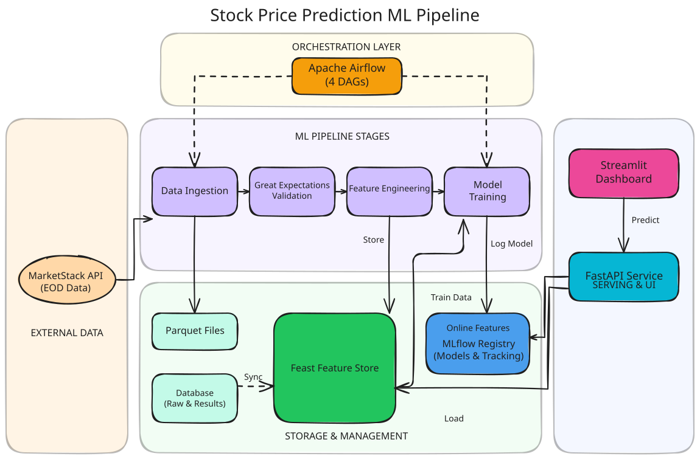

# Stock Price Prediction ML Pipeline

> End-to-end machine learning system for predicting next-day stock price direction using production-grade MLOps practices.


---

## Status

**Current Stage**: Full ML pipeline with REST API, Streamlit dashboard, Airflow orchestration, and comprehensive test suite.

**Next Step**: Prometheus for API latency/error-rate/infra metrics (deferred — see note below).

| Component | Status |
|-----------|--------|
| Data Ingestion | ✅ Complete |
| Data Validation | ✅ Complete |
| Feature Engineering | ✅ Complete |
| Feature Store (Feast) | ✅ Complete |
| Model Training + Registry | ✅ Complete |
| REST API | ✅ Complete |
| Streamlit UI | ✅ Complete |
| Testing (80+ tests) | ✅ Complete |
| Airflow Orchestration | ✅ Complete |
| Docker Deployment | ✅ Complete |
| Monitoring (Grafana) | ✅ Complete |
| Object Storage (MinIO) | ✅ Complete |

> **Note:** Grafana reads directly from the existing Postgres app database (`RawStockData`, `PredictionResult`) — there's no separate metrics-collection pipeline yet. Prometheus (API latency/error-rate/infra metrics) is a documented future step, not built.

---

## Demo

[](https://www.youtube.com/watch?v=02_BGvxwVms)

> ⚠️ Text overlays and captions coming soon. Live demo site in progress.

---

## Architecture



The system is organized into four layers:

| Layer | Components |
|-------|-----------|
| **Orchestration** | Apache Airflow (4 DAGs: ingestion, features, training, prediction) |
| **ML Pipeline** | Data Ingestion → Great Expectations Validation → Feature Engineering → Model Training |
| **Storage & Management** | MinIO (S3-compatible), Postgres DB, Feast Feature Store, MLflow Model Registry |
| **Serving & UI** | FastAPI REST API → Streamlit Dashboard |

---

## Introduction

A **portfolio project** demonstrating production ML practices for financial time-series prediction.

**What it does:**
- Ingests end-of-day stock data (AAPL, MSFT, GOOGL, etc.) via MarketStack API
- Engineers 30+ technical indicators (RSI, MACD, SMA, rolling stats, lag features)
- Stores features in **Feast feature store** with point-in-time correctness
- Trains a **CatBoost classifier** to predict if tomorrow's close > today's close
- Tracks experiments and registers models via **MLflow**
- Serves predictions through a **FastAPI** endpoint with real-time feature retrieval
- Orchestrates the full pipeline via **Airflow** DAGs (ingestion, features, training, prediction)
- Visualizes predictions via a **Streamlit** dashboard with interactive charts

**Why this project?** To try and get rich! *(But seriously speaking, I want to apply my uni knowledge and tutorial hells into practical projects, something I can used in daily stock trading)*

---

## Live Demo

> **Coming Soon** — A live demo will be available once the project is containerized and deployed. The Streamlit dashboard currently runs locally with 3 pages: Live Prediction, Historical Data, and About Model.

---

## Tech Stack

### Core ML
| Technology | Purpose |
|------------|---------|
| **CatBoost** | Gradient boosting classifier (chosen after benchmarking RF, XGBoost, LightGBM) |
| **scikit-learn** | Preprocessing, encoding, evaluation metrics |
| **pandas / NumPy** | Data manipulation and feature engineering |

### MLOps
| Technology | Purpose |
|------------|---------|
| **MLflow** | Experiment tracking, model registry, artifact versioning |
| **Feast** | Feature store (offline for training, online for serving) |
| **Great Expectations** | Data validation and quality checks |
| **pytest** | Testing with synthetic fixtures (hermetic CI) |

### Orchestration
| Technology | Purpose |
|------------|---------|
| **Airflow** | DAG-based pipeline orchestration (ingestion → features → training → prediction) |

### API & UI
| Technology | Purpose |
|------------|---------|
| **FastAPI** | REST API for model serving with prediction persistence |
| **Streamlit** | Multi-page dashboard (Live Prediction, Historical Data, About Model) |
| **Plotly** | Interactive price charts with prediction overlays |
| **SQLAlchemy** | ORM for prediction audit trail and stock data storage |
| **Pydantic** | Request/response schema validation |
| **Docker** *(planned)* | Containerization for deployment |

### Storage
| Technology | Purpose |
|------------|---------|
| **MinIO** | S3-compatible object storage for pipeline data, Feast offline store, and MLflow artifacts |

---

## Lessons Learned

### 1. Test-Driven Mindset
- Wrote test cases for each script before considering it "done"
- Promotes confidence when refactoring and catches bugs before production
- Building this habit early pays off in maintainability

### 2. Clean Project Structure with `src/` Layout
- Previously scattered scripts across root-level folders
- Now everything lives under `src/stock_prediction_ml/` — cleaner imports, easier packaging
- Following Python packaging best practices from the start

### 3. Separating Dev vs Prod Environments
- Learned this pattern at my previous job, now applied it here
- Separate configs (`dev.yaml` vs `staging.yaml` vs `prod.yaml`) prevent accidental production issues
- Makes deployment smoother when environments are explicitly defined

### 4. Organizing Data by Purpose
- Instead of dumping everything into a single `data/` folder
- Now structured: `raw/`, `processed/`, `feature/`, `meta/`, `feast/`
- Each folder has a clear responsibility — easier to debug and maintain

### 5. CLI Argument Parsers for Every Script
- Added `argparse` to all runnable scripts (training, ingestion, etc.)
- Enables calling scripts from terminal: `python train.py --config configs/prod.yaml`
- Essential for Docker containers and Kubernetes jobs — no hardcoded paths

### 6. Feature Engineering as a Production Step
- Before: just used raw columns from the dataset
- Now: dedicated script creates 30+ features (RSI, MACD, rolling stats, lags)
- Features are versioned and reproducible — not ad-hoc notebook transformations

### 7. Feast Feature Store Fundamentals
- Completely new topic I learned from scratch
- Key insight: batch features (training) != real-time features (serving) causes skew
- Feast solves this by materializing features to an online store for consistent serving

### 8. API Lifecycle with Health Checks
- Implemented FastAPI `lifespan` function for startup/shutdown logic
- Health check endpoint validates model and Feast store are loaded
- Production APIs need explicit dependency validation — fail fast on startup

### 9. Unit Testing for Streamlit UI
- Tested pure logic (utils, API client, chart builders) rather than Streamlit rendering (low ROI due to side effects)
- Used class-based test organization and httpx mocking for API client tests
- `conftest.py` mocks Streamlit module before imports to prevent server initialization in CI

### 10. AI usage to speed up project
- Learned how to use AI as a pair programmer which helps learning and not vibe coding until everything is broken.
- Before: 1 feature could take me weeks to complete.
- Now: 1-2 days.
- Additionally, I don't want AI to just suggest me the code. I want it to help me learn along the way by asking always to give me skeleton, then I would try to complete it, debug and run before asking for the full code.

---

## Setup & Running

### Prerequisites
- [Docker](https://docs.docker.com/get-docker/) + Docker Compose
- MarketStack API key (for data ingestion)

### Quick Start (Docker)

**Prerequisites:**
- Copy environment files: `cp configs/config.env.example configs/config.env.dev`
- Update `configs/config.env.dev` with your MarketStack API key

**First time:**
```bash
# Clone the repo
git clone https://github.com/raydiwill/stock-prediction-ml.git
cd stock-prediction-ml

# Start core stack (db, mlflow, api, ui)
make up-dev

# Train model + materialize features (one-time setup)
make init
```

**Returning:**
```bash
# Core stack is already initialized — just start it
make up-dev
```

**Development Workflow:**
```bash
# View logs
make logs

# Shell access to API container
make shell

# Stop core stack
make down-dev
```

**Airflow (optional):**
```bash
# Spin up Airflow UI at http://localhost:8080
make airflow-up

# Credentials come from AIRFLOW_ADMIN_* in configs/config.env.dev
# Retrieve anytime with:
make airflow-password

# Stop Airflow only (leaves core stack running)
make airflow-down
```

**Production Deployment:**
```bash
# Copy and configure prod environment
cp configs/config.env.example configs/config.env.prod
# Edit configs/config.env.prod with real credentials (see prod-specific notes in the file's comments)

# Start production stack (no bind-mounts, no dev ports)
make up-prod

# One-time: train model and materialize features
make init-prod
```

**Services (Dev):**
| Service | URL |
|---------|-----|
| FastAPI | http://localhost:8000 |
| Streamlit UI | http://localhost:8501 |
| MLflow | http://localhost:5001 |
| Airflow | http://localhost:8080 |
| Grafana | http://localhost:3000 |
| MinIO Console | http://localhost:9001 |
| MinIO API | http://localhost:9000 |

**Services (Prod):**
| Service | Port |
|---------|------|
| FastAPI | 9000 |
| Streamlit UI | 9501 |
| MLflow | internal-only |
| Airflow | 9080 |
| Grafana | 9300 |
| MinIO | internal-only |

---

## Object Storage (MinIO)

All pipeline data — raw/processed/feature parquet files, the Feast offline store, and MLflow
artifacts — lives in **MinIO**, an S3-compatible object store, instead of a bind-mounted `./data`
folder. This keeps every service (`api`, `ui`, `airflow`, `mlflow`) reading and writing through
the same network-accessible storage, with no host filesystem dependency.

**How it's organized:**
- A single bucket, `stock-prediction`, shared across environments
- Paths are scoped by an environment prefix: `dev/raw/`, `dev/processed/`, `dev/feature/`,
  `dev/mlflow/` locally; `prod/...` in production
- `configs/config.env.dev` sets `DATA_ROOT=s3://stock-prediction/dev`; the app resolves every
  data path through `data_path()` in [`config/storage.py`](src/stock_prediction_ml/config/storage.py),
  so nothing hardcodes `s3://` or local paths directly
- The `minio-init` service creates the bucket idempotently on `make up-dev` — no manual setup
  needed

**Credentials** (`configs/config.env.dev` / `.prod`):
```bash
MINIO_ROOT_USER=minioadmin
MINIO_ROOT_PASSWORD=minioadmin       # prod: use strong, unique credentials
S3_ENDPOINT_URL=http://minio:9000
MLFLOW_S3_ENDPOINT_URL=http://minio:9000
AWS_ACCESS_KEY_ID=${MINIO_ROOT_USER}
AWS_SECRET_ACCESS_KEY=${MINIO_ROOT_PASSWORD}
```

**Browsing storage:** open the MinIO Console at http://localhost:9001 (dev) and log in with
`MINIO_ROOT_USER` / `MINIO_ROOT_PASSWORD` to inspect buckets, or use the `mc` CLI against
`http://localhost:9000`.

**Switching a script to local storage** (e.g. for quick local debugging without Docker): set
`DATA_ROOT=data` instead of an `s3://` URI in your environment — `data_path()` falls back to
plain local paths automatically, no code changes needed.

---

## Project Structure

```
src/stock_prediction_ml/
├── api/             # FastAPI endpoints + middleware + schema
├── config/          # Centralized Pydantic settings + storage.py (MinIO/S3 path abstraction)
├── feast_repo/      # Feature store definitions + services
├── model/           # Training pipeline + MLflow registry + pyfunc wrapper
├── features/        # Feature engineering (30+ indicators)
├── data_validation/ # Great Expectations suite
├── db/              # SQLAlchemy models + session + ingestion
├── marketstack/     # Data ingestion from MarketStack API
└── ui/              # Streamlit dashboard
    ├── app.py           # Entry point + navigation
    ├── utils.py         # Symbol validation, formatting
    ├── components/      # API client (httpx), Plotly charts
    └── pages/           # Prediction, Historical, About Model

tests/               # 9 modules, 80+ hermetic tests
configs/             # YAML training configurations
notebooks/           # Exploration & tuning (01-06)

orchestration/
├── dags/            # Airflow DAGs (ingestion, features, training, prediction)
├── tests/           # DAG validation + per-DAG structure tests
└── airflow.cfg      # Airflow config (LocalExecutor, SQLite)
```

---

## Acknowledgments

Built as a learning project to understand production ML systems. Inspired by:
- [Feast documentation](https://docs.feast.dev/)
- [MLflow Model Registry](https://mlflow.org/docs/latest/model-registry.html)
- [Streamlit documentation](https://docs.streamlit.io/)
- [FastAPI documentation](https://fastapi.tiangolo.com/)
- [Apache Airflow documentation](https://airflow.apache.org/docs/)

---

*Questions or feedback? Open an issue or reach out!*
